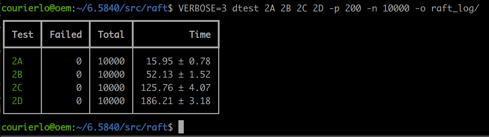
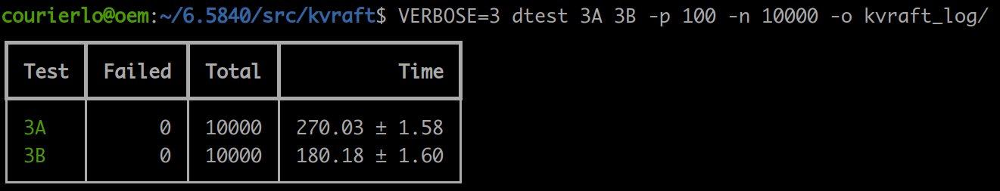
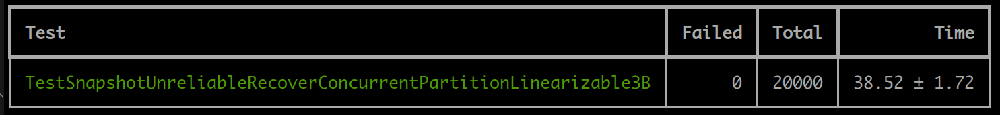
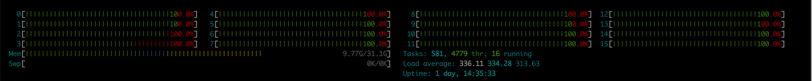
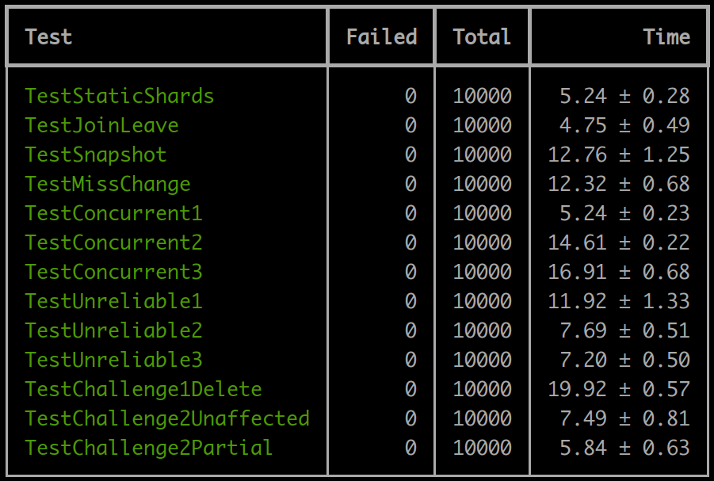

# MIT 6.824 (现6.5840) 通关记录

历经一个半月，总算将6.824所有lab打通关，并且Lab2/3/4能稳定通过一万次以上。本科的时候就想挑战来着，可惜那时候实在是太菜，除了打打acm做一些算法题以外没啥其他项目技能，Linux也用不习惯。研究生阶段做的是机器人相关，Linux用得多了，也有了一些微不足道的项目经验，于是心想：把以前挖的坑填了吧。奈何实验室杂事太多，兼有论文压力，刷课进展并不迅速，有时甚至需要两个月才能把一门课的lab搞完。目前进展是：MIT 6.S081 -> CMU 15-445 -> MIT 6.824. 前两门课没写什么notes，过了一段时间有些细节都忘了，之后需要补上才行。

如果要为这些公开课的难度排序，以本科生的视角，我认为应该是这样6.S081 < 15-445 < 6.824. 没有任何并发编程基础的同学不建议上来就硬搞824这门课，如果你能把前面两门操作系统课和数据库的课程认真学习完并且lab独立完成，你做824会轻松很多。说点题外话，现在类似"xxx课已经烂大街了/人手一份"的言论甚嚣尘上，然而一看15-445 2022的Leaderboard，Project 4通关人数才100出头(我三月初做完的时候，才刚40人)，足以看出有相当一群人将抄袭来的项目写进简历。之前有位老哥分享了内核求职经历和lab的通关总结，底下好一群人伸手就要代码，真是有碍观瞻。当然咯，有句话是这么说的：“他只是个研究生，他想毕业，他有什么错？”，同理可得：“他只是个学生，他想找到好工作，他有什么错？” 也不知道该怎么评价这种浮躁的风气，只能说这个糟糕的大环境在不断地培养一批又一批的复制人了，不管是优质的还是劣质的。不过我想，还是诚实一点好。

## Lab1 MapReduce
第一个lab属于热身性质的Lab，你可以借这个Lab熟悉Go的写法，后面的三个Lab不会用到比第一个Lab更多的语法或者特性，要坚信编程语言绝不是做lab的障碍。上手之前，建议通读论文的前四节，并且彻底搞懂Fig 1想要表达什么。6.824的lab中，你可以认为每个文本文件就对应Fig 1中的一个'split'，每个接收到Map任务的Worker，需要读这个文件并将所有单词分别根据哈希函数`ihash(key) % NReduce`映射到NReduce个中间文件去，Fig 1中已经很直观地画出来了。总共会有`num(split)*NReduce`个中间文件.这些中间文件存储的是类似`(abc, 1)`这样的kv对。在Reduce阶段，每个Worker需要处理所有split组对应编号的中间文件，统计词频再输出到output文件。举个例子，比如说我现在有3个文本文件需要处理，`NReduce = 2`, 那么Map阶段要求出中间文件`tmp-0-0, tmp-0-1, tmp-1-0, tmp-1-1, tmp-2-0, tmp-2-1`, Reduce阶段，需要有两个worker分别处理`tmp-0-0, tmp-1-0, tmp-2-0`以及`tmp-0-1, tmp-1-1, tmp-2-1`这些中间文件。中间数字表示文本文件编号，最后一个数字范围`[0,NReduce)`. 为了能从log更好辨认worker，我选择让coordinator为worker按顺序编号，如果让worker自带随机数编号实现会更简单一些。

### 小小的建议
1. 一把大锁保平安。Coordinator处理来自Worker的请求时，Handler直接上一把大锁，请求一个接一个处理。这样Coordinator维护的状态就不可能出现数据竞争，当然咯，这样的话并发性能拉是拉了点。
2. lab建议将10s内无反应的worker视作dead，注意此时需要回收这个worker的任务。Worker可以定时发送心跳告知Coordinator它没魂归西天，心跳和请求可以合并作一个Request，用额外的参数告知是request还是heartbeat即可。Coordinator在分配任务之间检查一下最后访问时间即可。
3. 仔细阅读lab给的Hints，条条有用

## Lab2 Raft
Raft看上去很难，实则不然，就是需要花点时间耐心地捋顺作者行文思路。建议精读论文(Extended Version那篇)前八章，把Fig. 2那张大图的**所有**细节都弄懂，再思考如何将算法转化为代码。最好直接看英文，论文写得很好，没有看中文的必要，以避免不必要的误会。Lab2~4我都没有使用过timer判断是否超时，timer的使用是非必须的。条件变量也没用过(主要是没想好咋用，用好了肯定能减少上锁次数)。合理地使用channel可以减轻你的工作负担。总之使用Go最基本的语法也是能完成这些lab的，不必有语言焦虑。

Raft的核心可以分为这么几个常驻Loops: `electionTicker`, `appendEntriesTicker`, `updateCommitIndex`, 以及`applyCommittedEntries`. 然后就是三个RPC handler: `AppendEntries`, `RequestVote`以及`InstallSnapshot`. 最后就是供上层kv server调用的`Snapshot`.

### `electionTicker`
该Loop作用是每隔一段时间`(50+randInt63()%300)`便去尝试一次选举。只有两种情况应该发起选举——
1. follower距离上次收到心跳的时间超过了`election_timeout`
2. candidate距离上次发起投票的时间超过了`election_timeout`. 
我的`election_timeout`是一个400~950ms的随机时间。

我们需要并行地向其他server发送投票请求，等待RPC的过程中是不能持有锁的，毕竟不能影响其他Loop的运行，可以这样下面这样操作
```go 
  // ... update status before election, vote for self
  rf.mu.Unlock()

  // send RPC requests at the same time (NOT one after another!!)
  finishCh := make(chan RpcRes)
  for server := range rf.peers {
    if server != rf.me {
      go rf.sendRequestVote(server, &args, &replies[server], finishCh)
    }
  }

  // collect replies
  rpc_count := 0
  for rpc_count < len(rf.peers)-1 {
    res := <-finishCh
    rpc_count++

    rf.mu.Lock()

    // ... do someting here

    rf.mu.Unlock()
  }
```
这样一来我们可以通过管道接收到RPC的是否成功以及回复的server编号。这样会带来一个小问题：如果server已经进入到下一个term了，而它又收到了上个任期它发送的RPC的回复，怎么办？答案是RPC的回复次数+1,但是无视掉这个回复。无论什么时候都要记住一个原则：

**对于老旧的term的消息，除了需要统计数量的情形之外，统统无视之！**

在收集完所有发出去的RPC回复以后，该次elction结束，如果此时candidate的term和**发起选举时的一样**，并且得票数量不够的话，转会follower态即可。
 
另外，获取到足够票数的candidate要立刻成为leader，需在收集RPC结果的loop中判断之,成为leader需要将nextIndex以及matchIndex初始化. 如果收到term更大的reply, candidate应该立刻退为follower, 重置状态；**无论**是什么情况造成的stepdown, 为了避免它立马提出选举，顺便更新下收到心跳的时间。

小小优化：在成为leader以后，**立刻**向其他server尝试一次appendEntries，以宣示领导地位以及加速catch up. 虽然你不这么做也不影响正确性，因为下一个`ticker`发送，但是在lab3 speed test中，这个优化可以避免你超时。

### `appendEntriesTicker`
每隔10ms尝试一次AppendEntries. lab要求说心跳不能过快，最好维持在10Hz，好像lab2测试心跳频率不太强劲，lab3的test会检查心跳频率，太快会fail. 所以不妨再维护一个数组`lastSendHBT[]`，记录一下上次向第i个服务器发送Entry的时间。如果`rf.nextIndex[i] > rf.logLength`并且离上次发送Entry的时间不足100ms，就什么也不发就可以了。由于lab 2d需要引入snapshot,在尝试append的过程中，需要判断这次到底是需要对方AppendEntries还是InstallSnapshot。具体流程如下：
```go
  func (rf *Raft) appendTicker() {
    for rf.killed() == false {
      go rf.startAppending() 

      time.Sleep(10 * time.Millisecond)
    }
  }

  func (rf *Raft) startAppending() {
    rf.mu.Lock()
    if rf.state == LEADER {
      // ... some data structure preparation

      for i := range rf.peer {
        if i == rf.me { continue }

        if rf.nextIndex[i] > rf.SnapshotIndex { 
          // ... control heartbeat frequency at around 10Hz. If there is nothing to send, continue
          
          // ... create append_args[i]

          if rf.nextIndex[i] <= rf.logLength {
            // ... put **some** log entries into append_args[i].Entries
          }
          rf.lastSendHBT[i] = time.Now() // remember!
        } else {
          // ... we should send snapshot to let the follower catch up
        }
      }

      // ... send RPC, AppendEntries or InstallSnapshot

      rpc_count := 0
      for rpc_count < tot_rpc_cnt {
        // ... deal with each reply, don't forget to lock/unlock
      }
    } else {
      // not leader, do nothing
      rf.mu.Unlock()
    }
  }
```
处理每个RPC的reply也有很多讲究，必须严格按照论文Fig. 2以及Fig. 13的要求来写。还需要记住另一条原则：

**收到term比自己大的reply时，立马退位，转为follower，修改term, votedFor, state以及上次收到心跳的时间戳**

对于`AppendEntries`的回复:

如果返回`success==true`, 更新`matchIndex`以及`nextIndex`. 更新`matchIndex`能直接用`nextIndex`或者`logLength`更新吗？不能！因为`nextIndex`在此次RPC途中可能就被更新了，为了保证时时刻刻都是正确的，最好用`prevLogIndex + len(send_entries)`对应这次RPC reply成功时潜在的`matchIndex`更新(和自身比较取个`Max`)。否则可能出现更新的RPC reply接受得早，而matchIndex却落后的情况，这种短暂的非一致性可能会出事。

如果返回`success==false`,**并且**出现了inconsistency的情况，则需要回退了。inconsistency指的是follower没有找到一个entry和leader的`prevLogIndex` & `prevLogterm`对应，返回了false. lab要求要加速回退，不能一个个退否则太慢。Leader和followers可以遵循以下几条rules以加速回退：
1. 如果follower的log没有`preLogIndex`(不够长), 返回`conflictIndex = len(log), conflictTerm = None`
2. 如果follower有`preLogIndex`只是Term对不上，返回`conflictTerm = log[preLogIndex].Term`, 并搜索自己的log找到第一个`term == conflictTerm`的index作为`conflictIndex`
3. leader收到冲突的回复，首先搜索log找到`conflictTerm`, 找到的话`nextIndex = 那个term最后的entry的index + 1`
4. 如果没找到任何`entry.term = conflictTerm`, 将`nextIndex = conflictIndex`

`conflictIndex != -1`表示发生了冲突。查找一个term对应的最大的那个index，二分查找就好了，二分别写歪了。

对于`InstallSnapshot`的回复:
比`AppendEntries`简单多了，无非就是判断是否需要stepdown，不stepdown的话更新一下matchIndex和nextIndex即可。

### updateCommitIndex
Leader专属loop, 见于`Rules for Servers`最后一条——
``` go
If there exists an N such that N > commitIndex, a majority of matchIndex[i]>=N，
and log[N].term == currentTerm: set commitIndex = N
```
将这条规则翻译成人类语言：只有当新leader的entry被复制到大部分机器上，才能更新commitIndex.

这条规则用来保证安全性的。新的leader刚刚上位的时候，它是不知道之前term的信息是否commited，也就是说它不知道之前term的entries是否被复制到了大部分机器上. 有了这个约束，当前term的entry被复制到了大部分从机上，这时才可以更新leader的commitIndex. 那么如何得到最大的那个`N`呢？这就是个经典的第k大问题了，鉴于followers并不很多，暴力sort再找就好了。

这条规则会带来一个问题：如果leader一直没有发送新log entry的需求，follower的`commitIndex`也就一直无法更新. 解决办法很简单，leader上线后可以发送一条**空**日志(nop), 这日志不干任何事，但是可以假装"有一条新entry复制到了多数节点"，这样`commitIndex`就可以推进了，从而使crashed过后的server可以通过log恢复状态而不被卡住。这里**不建议**在lab 2实现这个功能，因为不知道测试套件会不会有什么约束啥的，我们可以在更上层的地方开始发送nop的操作。记住这个现象，你很可能在lab 3/4中遇到。

### applyCommittedEntries
我采用的是定期检查commit的策略，所以用一个常驻goroutine loop。使用触发策略会更复杂一些，需要更加谨慎地处理一些通信，当然，这是有意义的，在lab3 speed test中，触发式apply会比定期检查快很多，前者只需3~4s便能完成测试，后者则需要20s左右。
这个loop对应All servers的第一条rule——
```go
If commitIndex > lastApplied: increment lastApplied, apply log[lastApplied] to state machine.
```
好的，如果你兴致勃勃地将这些entry直接发送到applyCh中，boom! 你会发现怎么log没动静了？？恭喜你死锁啦！这个死锁还是挺难发现的, 因为这和Tester相关。认真考虑下面这种情况——
```go
______________________________________________________________________________________
| Goroutine 1     | Goroutine 2 (applierSnap)                                         |
| mu.Lock()       | m <- applyCh                                                      |
| applyCh <- msg  | Snapshot() : mu.Lock (when log length % 10 == 0, take a snapshot) |
_______________________________________________________________________________________
```

当`applyCommittedEntries()`想要继续向管道applyCh发送msg的时候，恰好此刻`applierSnap`调用`Snapshot()`在等待获取锁mu，但是`applyCommittedEntries()`会一直卡在发送，因为管道的信息没有人接收，那么mu锁就一直不会被释放，形成了死锁。

解决办法很简单，如果能先把要apply的entries发送到缓冲区，缓冲区的entries是不用上锁就能向applyCh发送的。为了方便，可以使用一个缓冲channel，将数据**批量**发送到buffer中。这时候，如果你用的也是定期检查的策略，你也许就真的按照论文给的`commitIndex > lastApplied`这个条件, 一股脑地把所有可以apply的log都发出去了，恭喜你，你可能又炸咧！测试样例有这么一种情况：server在crash以后需要恢复上千条log, 假设很不幸，你的buffer太小，你会看到很稀奇古怪的现象。只把buffer改大点就可以了吗？更不幸的是, 这个server好巧不巧是个leader, 那么这个server就会花很多时间将msg发到buffer中，它没空发送heartbeat给其他follower了！这就会造成不必要的re-election。所以一次最多发一两百个msg到buffer就可以让`applyCommittedEntries`睡觉去了~~扎不多得咧~~，长命功夫长命做。再开一个协程把buffer的msg发到applyCh就好了。

也许你会问：哎呀，你只是把msg发送到了buffer，却更新了lastApplied, server炸了怎么办？反正机器重启后lastApplied都会归零再恢复的，炸了就炸了吧，该apply到的还是会apply到的。

### AppendEntries Handler
Fig. 2中无论是什么handler，reply false意味着立刻返回而不要进行其他操作。你可以按照Fig.2的要求**按顺序**进行判断和操作. 只有`rf.SnapshotIndex <= args.PrevLogIndex`才能开始进行step 2 ~ step 5的检查，否则你肯定会遇到切片越界的问题，这个约束不难理解。不过，还是得提醒你，别忘记处理`args.Term > rf.currentTerm`的RPC请求。第二条rule需要加上回退优化。对于第三条rule——
```go
If an existing entry conflicts with a new one (same index but different terms),
delete the existing entry and all that follow it.
```
个人理解，我们在前面的检查到冲突后就立刻return false，那么到这里就已经找到了对的上号的prevLogIndex和prevLogTerm. 这句话的意思是，我们要把发现冲突的entry及其后面的entries统统删掉，再把new entries插入尾部。可以直接按照要求，找到冲突点，截断，修改log长度，再进行插入即可。对于第五条rule——
```go
If leaderCommit > commitIndex, set commitIndex = min(leaderCommit, index of last new entry)
```
即使追加了新的entries，在较为落后的情况下，follower的log长度可能还没leaderCommit大，所以得取个最小值。而leaderCommit也是有可能比`index of last new entry`更小的，但是我们不能让follower commit得比leader快，还是得取个Min. 请你思考一下，follower不能比leader commit更快，那follower能比leader apply更快吗？

(当你的`time.Sleep`搞错数量级，后者是有可能发生的，这个放到Lab4再说。你可以想想如果上层在以远超`appendTicker`的频率疯狂start()，会发生什么？)

### RequestVote Handler
比较简单，但是也有一些情况需要认真考虑的：
1. 多个candidates，如果follower给一个candidate投过票，而现在来了个更大的term的candidate请求投票该怎么办？
votedFor代表的是当前任期的投票，来了个更大term的candidate自然要退为follower,更新任期和清空votedFor，那么这个任期的投票就给新的candidate就好了
2. `candidate is at least up-to-date as receiver's log`，意味着你得比较一下两个log之间的的新旧程度，这点论文中提到了相同长度比较term, 不同长度比较最后一个entry的term即可。

### Snapshot
将`index <= rf.SnapshotIndex`过滤掉。去掉前面的entries不能直接简单地`log = log[index+1:]`，需要手动复制后面的entries，否则前面的写法会造成内存泄漏。`rf.log[0]`有可能会被访问到，不妨将`rf.log[0].Term = rf.SnapshotTerm`，这样就万无一失。

### InstallSnapshot Handler
lab2的`rf.persister.Save(raftstate, rf.SnapshotData)`保证了`raftstate`和`snapshot`是一起`persist()`的，那么persist过的`state`和`snapshot`一定是匹配的。这就是和TA写的guidence不一样的地方，也就不需要额外的复杂操作了。没啥好说的，分类讨论下`args.LastIncludedIndex`小于等于或者大于`rf.logLength`这两种情况就行。记得在之前过滤掉旧的`snapshot`，以及在install后更新状态。

### P.S.
1. 什么时候更新lastHeartbeat(上次收到心跳的时间)
只要收到了合法的请求，就应该更新；某个server开始了新的选举；某个server**给了**某个peer选票(没给票不重置，让有最新的log的server出来选~~办事同阿公做嘢~~leader)
2. 什么时候应该`persist()`
persist state修改了就该`persist()` ~~像是一句废话~~
3. 从一开始就要用一个变量单独维护log的长度，索引的时候加上偏移量就可以了，不要等到做2d的时候再改

i5 12600K + 32GB内存，可以一次性并发200个


## Lab 3 KV Raft
从Lab3开始，个人设计的空间就大了很多。如果你是看别人的设计再写的代码，肯定比自己想要快得多。为了遵循实验要求，咱还是自个儿设计自个儿做吧。

此次Lab做的是基于Raft的可容错KV服务，要实现的东西并不很多。KV服务器要向客户端提供三种操作——Put/Append/Get，而这三种操作都要经过raft层共识添加到log后，再通过applyCh返回给上层的KV server, server再根据applyMsg作出相应动作就可以了。

Lab标题的Fault-tolerance你可以简单认为：如遇失败，一直重试该操作直至成功为止。观察代码我们可以发现，client端的`Get/PutAppend`请求是串行进行的，但是kv server可能会同时收到多个client的请求。这就需要在server端判别"这是哪一个client的请求"以及"这是该client的第几个请求"。而且必须满足线性一致性，就像系统只有`one copy of its state`. 也就是说每个请求都应该可以观察到之前那些请求的修改。

当通信出现异常，请求会失败，这种失败很容易处理，重试即可；那么，会不会出现一个请求执行时间超长，而通信又不中断的情况呢？

假设你一开始的设计是，client对server group进行轮询，只要RPC返回了false，就开始对下一个server进行RPC请求。server端在接收到请求后, handler调用`rf.Start()`让raft开始复制操作，再用一个常驻的goroutine loop从`applyCh`获取`ApplyMsg`, 进行重复性检测并执行完操作后，通过管道向handler发送结果。这样做应该没啥问题...吧？然而这样设计并没有超时检测。你也许天真地认为，RPC超时自动就返回false了，那就错了。

考虑这么一种情况：server在接收到一个请求后，调用了`rf.Start()`，从`applyCh`获取`ApplyMsg`的goroutine loop需要等待消息传上来，处理后再通知handler可以返回结果了。不知怎地，raft并没有成功apply这个操作的log entry, 而恰好此时又没有别的client有操作请求，那么raft就不会推进共识，handler会一直等待raft，而RPC也是不会返回false的。这时候整个系统就一点动作都没了。所以我们需要在两端的任意一端实现超时监测，一旦发现超时，就重新发送相同的操作请求。

那么问题又来了，该让哪一端进行超时检测呢？为了偷懒，我直接让client执行这个检查，并且，client不会接收同一个操作请求的旧的RPC的成功的信息：
```go
func (ck *Clerk) Get(key string) string {
  // poll
  for {
		for i, j := ck.leaderServer, 0; j < len(ck.servers); j++ {
			ck.mu.Lock()
			cur_ser := (i + j) % len(ck.servers)

			// A new rpc try for another server
			// We ignore the older ones even if it is OK
			ck.rpcNum++
			ck.rpcStatus = WaitForRPC
			ck.rpcGetStr = ""
			ck.mu.Unlock()

			go ck.sendGetRequest(cur_ser, key, ck.rpcNum)

			for t := 0; t < 200; t++ {
				ck.mu.Lock()
				if ck.rpcStatus == RPCWithRes {
					// We find that a rpc has successfully get the value of the key
					// It MUST be the current rpc's response
					ck.seqNum++
					get_value := ck.rpcGetStr 
					ck.mu.Unlock()
					return get_value
				} else if ck.rpcStatus == RPCWithoutRes || ck.rpcStatus == RPCFailToCall {
					// It MUST be the current rpc's response
					ck.mu.Unlock()
					break
				}

				ck.mu.Unlock()
				time.Sleep(time.Millisecond * 10)
			}
		}
	}
}

func (ck *Clerk) sendGetRequest(server int, key string, rpcNum int) {
	args := GetArgs{Key: key, SeqNum: ck.seqNum, ClientId: ck.clientId}
	reply := GetReply{}
	ok := ck.servers[server].Call("KVServer.Get", &args, &reply)

	ck.mu.Lock()
	defer ck.mu.Unlock()

	ck.serverId[server] = reply.ServerId
	if rpcNum == ck.rpcNum {
		if ok && reply.Err == OK {
			ck.rpcGetStr = reply.Value
			ck.rpcStatus = RPCWithRes
			ck.leaderServer = server
		} else if ok && reply.Err != OK {
			ck.rpcGetStr = ""
			ck.rpcStatus = RPCWithoutRes
		} else {
			ck.rpcGetStr = ""
			ck.rpcStatus = RPCFailToCall
		}
	}
}
```
我让client每个10ms检查一下RPC的结果，如果超过2s都没有结果，就对下一个server进行相同的请求。这样就能使raft正常推进了。如果在server端进行超时检测，你可能要额外多花点时间处理一些情况，比如说，用管道通知handler完成操作的话，handler可能已经超时返回了，那么就没有人接收可能会发上来的信息了。

既然服务端不做超时检测，那么就很简单了，以`Get`为例：
```go
type ResultMsg struct {
	ApplyMsgFromRaft raft.ApplyMsg
	ResultStr        string
}

func (kv *KVServer) Get(args *GetArgs, reply *GetReply) {
  // .. check whether this server is killed or not

  rf.mu.Lock()
  defer rf.mu.Unlock()

  // ... if not leader, return immediately
  // ... filter old or same requests from clients

  // the first request or a request with a higher sequence number
  var cur_index int
  var cur_term int
  var is_leader bool
  cur_op := Op{Typ: GET, Key: args.Key, Value: "", ClientId: args.ClientId, SeqNum: args.SeqNum}
  if cur_index, cur_term, is_leader = kv.rf.Start(cur_op); !is_leader {
    reply.Err = ErrWrongLeader
    return
  }

  // there might be two requests with the same index, let the preceding one fail
  if pre_ch, ok := kv.chanMap[cur_index]; ok {
    fake_apply_msg := raft.ApplyMsg{CommandValid: false, SnapshotValid: false}
    pre_ch <- ResultMsg{ApplyMsgFromRaft: fake_apply_msg}
  }
  kv.chanMap[cur_index] = make(chan ResultMsg)
  cur_ch := kv.chanMap[cur_index]
  kv.mu.Unlock()

  res_msg := <-cur_ch

  kv.mu.Lock()
  if res_msg.ApplyMsgFromRaft.CommandValid {
    cmit_op := res_msg.ApplyMsgFromRaft.Command.(Op)
    // this kvserver is the leader and have committed the op at its own term (to ensure only the leader can reply the result)
    // take the copy of the result msg because kvMap could be modified before a preceding request read the kvMap
    if res_msg.ApplyMsgFromRaft.CommandTerm == cur_term && cmit_op.ClientId == args.ClientId && cmit_op.SeqNum == args.SeqNum {
      reply.Value = res_msg.ResultStr
      reply.Err = OK
      return
    }

    reply.Err = ErrWrongLeader
    return
  }

  reply.Err = ErrNotCommand
}

// long-running goroutine
func (kv *KVServer) routeApplyMsg() {
	for apply_msg := range kv.applyCh {
		if kv.killed() != false {
			continue
		}

		res_str := ""
		kv.mu.Lock()
		if apply_msg.CommandValid {
			kv.lastIncludedIndex = apply_msg.CommandIndex
			op := apply_msg.Command.(Op)
			// a new committed operation that have not seen before, execute it
			if last_op, ok := kv.lastOpMap[op.ClientId]; !ok || last_op.SeqNum != op.SeqNum {
				switch op.Typ {
				case PUT:
					kv.kvMap[op.Key] = op.Value
				case APPEND:
					kv.kvMap[op.Key] += op.Value
				case GET:
					// we need to send a copy of GET result to handler function in case of modification by PUT or APPEND
					res_str = kv.kvMap[op.Key]
				default:
					// should not happen
				}

				// update last_op
				kv.lastOpMap[op.ClientId] = op
			} else if ok && last_op.SeqNum == op.SeqNum && op.Typ == GET {
				// A GET operation, we must return the value even if it is a duplicate one 
				res_str = kv.kvMap[op.Key]
			}
		}

		// route apply msg to handler function and let them decide whether it is a msg from leader or some other errors
		if ch, ok := kv.chanMap[apply_msg.CommandIndex]; ok {
			ch <- ResultMsg{ApplyMsgFromRaft: apply_msg, ResultStr: res_str}
			// free last index channel since we must have applied it before
			delete(kv.chanMap, apply_msg.CommandIndex-1)
		}

		if apply_msg.SnapshotValid {
			// we MUST restore the state with a newer snapshot from the leader
			kv.restoreServerState(apply_msg.Snapshot)
		}

		kv.mu.Unlock()
	}
}
```

剩下的`snapshot`很简单，用个long-running goroutine定期检查是否需要snap就可以了，自己掂量要保存kv server的什么状态。

我的Lab2/3运行时间和给出的参考时间很接近甚至更优，除了和测速相关Lab3的两个test；总运行时间不相上下。在多个client下我的方法RPC数量要比参考值多很多，有时甚至有个三四倍。感觉在raft层还有很大的提升空间, 循环检测的策略属实是有点拉。

### 小小的建议
1. 善用--race检查数据竞争。仔细检查代码是否存在内存泄漏或者goroutine泄漏。有时候泄漏并不影响通过test，但是性能反映地很明显。

Lab3-Lab4都是并发100个了

Linearizable多测点，测爆它！



## Lab 4 ShardKV
shards意为"分片"，一个分片就是一个kv pairs的子集；举个例子，"a"开头的key就可能是一个分片，"b"开头的key就是另一个。分片的目的在于性能。每一个replica group只处理一些分片，而这些groups是并行处理的；因此整个系统的吞吐量会随着组数成比例增加。

分片kv存储需要两个主要的组件. 第一，replica groups. 每个replica group负责shards的一个子集. 一个replica包含了少量的使用raft去复制shards的servers. 第二，shard controller. ctrler决定了哪一个group处理这个shard; 这个信息被称为configuration. conf可能随着时间的变化而变化. 客户端会询问ctrler对应的key是哪一个replica group，而replica group则会询问控制器要服务哪些shards. 整个系统只会有一个控制器，提供和lab3类似的kvraft service.

一个分片存储系统必须能够将分片从一个group移到另一个group. 这是因为
1. 负载均衡
2. groups可能加入或者离开系统: 新的group可以增加容量，或者现存的groups需要下线修复或者直接不干了

本次lab主要挑战是reconfiguration -- groups的分片需要随着分配策略的改动而在集群之间流动. 在单个group中，所有成员需要在请求到来且配置更改时达成共识。比如说，这个请求是发生在配置更改之前还是之后。如果是之前，这个shard的新的持有者必须看到请求的效果。如果是之后, 请求不会被执行，客户端需要对新的持有者发起重试。 推荐的处理方式是让每个replica group使用raft去记录(log) puts/appends/gets的序列以及reconf的序列. 你需要保证同一时间每个shard最多只有一个replica group处理请求.

### 4A: Shard Controller
这个很简单，而且不需要`snapshot`，可以大量借用Lab 3的代码，只说说需要`rebalance`的两种情况。
1. Join: 加入新组后，每次选择一个拥有shard最多的组和一个拥有shard最少的组，shard逐个挪动，直到shard数量差值小于等于1, 而且GID 0组没有shard为止。
2. Leave: 如果集群后再无raft组，要将所有shard丢给GID 0. 否则删除并平均分片给依然存在的组。要确保相同的命令在不同的节点上能够产生相同的配置.

要注意go中map的遍历顺序是non-deterministic的，它不会按照key的大小顺序来遍历的，而`rebalance`的操作要在ctrler集群中的每个server结果都一样，所以你得把keys提取出来，排序一遍，按照排好顺序的keys遍历map完成迁移才行。要注意`GID == 0`的边界情况。

### 4B: Sharded Key/Value Server
4b算是整个824最难的一个lab，它难就难在你得自己设计出分片迁移流程，需要仔细推敲，编码并不困难。Think twice, code once.

首先你得想清楚，究竟有什么信息需要经过raft层达成共识。`PUT/APPEND/GET`自不必说，leader需要负责这三种操作，调用`rf.Start()`发起共识；由此类推，当conf发生更改的时候，我们也必须让leader发起共识，从而让followers们根据applyCh发上来的msg，完成配置更改，不妨将这个动作命名为`RECONF`; 配置发生更改后，我们需要完成分片在机器之间的迁移，有pull和push两种方式。为了简化设计，直接采用push，让server主动地将shard信息handoff到另一个集群手里，不妨将这个动作称为`HANDOFF`. 可以将发起`HANDOFF`请求的server视为一种特殊的client，`HANDOFF`类似于`PUT/APPEND/GET`。当发起`HANDOFF`的server收到成功的结果后，需要删除已经移交了的shard的kv pairs，同样地，我们需要通过raft使得followers也删除移交过的shard信息，可将这种操作命名为`HANDOFF_DONE`。综上，总共有六类动作需要经过raft共识再执行。

自然地，我们需要定时检测conf是否发生了更改，conf更改以后是否将shard递交到了别的集群。于是我们必须得维护每个shard的状态了，这样为我们检测哪个shard需要移交，和判断别的集群发过来的`Handoff`操作是否重复提供了便利。Shard只会有三种状态：`IDLE, PUSH, PULL`. 当所有shard都是`IDLE`态时，说明当前的conf已经完成了所有的handoff, 旧的handoff消息应该统统无视掉。一旦有shard状态不为`IDLE`，则说明本次conf，shards在集群之间没有移交完毕，这个时候我们不能更改conf，必须等到该移交的shard都移交完毕，才能更新conf. 这是为了满足conf必须连续的原则。检查什么shards需要handoff时，需要计算新旧conf的差异，所以还得保存旧conf的状态。

把上面的想法转化为代码，不难得出下面几个long-running goroutine以及`Handoff`的handler框架:
```go
func (kv *ShardKV) updateConfig() {
  for kv.killed() == false {
    kv.mu.Lock()

    // ... if this server is not leader, go to sleep

    // ... check each shard's state

    if is_all_idle {
        new_conf := kv.mck.Query(kv.curConf.Num + 1)
        // conf_num must be consistent
        if new_conf.Num == kv.curConf.Num+1 {
          kv.curConfNum = new_conf.Num
          // the first request or a request with a higher sequence number
          cur_op := Op{Typ: RECONF, ConfNum: new_conf.Num, Conf: new_conf}
          // make followers reconf as well
          kv.rf.Start(cur_op)
        }
      }

    kv.mu.Unlock()
    time.Sleep(100 * time.Millisecond) // 10Hz is enough
  }
}

func (kv *ShardKV) tryHandoff() {
  for kv.killed() == false {
    kv.mu.Lock()

    // ... if this server is not leader, go to sleep
    
    // ... no PUSH shard(s), go to sleep

    // ... extract handoffArgs, including kv map, last op history, etc.
    //     (might need to handoff to multiple groups)

    kv.mu.Unlock()

    for _, arg := range args {
      kv.handoffArgsCh <- arg
    }

    time.Sleep(20 * time.Millisecond)
  }
}

func (kv *ShardKV) pollHandoff() {
	for args := range kv.handoffArgsCh {
		// in case of gid 0
		if servers, ok := kv.curConf.Groups[args.TargetGID]; ok {
			// ... try each server to handoff shards one after another
			// ... quite similar with client's PutAppend / Get
      // ... don't forget to clear kvm if RPC returns successfully
		}
	}
}

func (kv *ShardKV) Handoff(args *HandoffArgs, reply *HandoffReply) {
	// ... similar with PutAppend / Get handler in lab 3
  // ... need to check config number additionally
  // ... think carefully what err code should we return
}
```
这种实现方式延续了Lab2鲁莽风格，但也节省了很多功夫。无论是发送方集群crash后又再重启，抑或是接收方crash后又重启，还是RPC通信丢失，我们总会去尝试上次没能完成的动作，直到成功为止，尤其是`HANDOFF`和`HANDOFF_DONE`。但这完美了吗？也不见得。系统还是可能会存在活锁的情况。在log上具体表现为：两个集群crash后重启，回到了shardState存在`PULL`但不存在`PUSH`的中间态，显然现在两者都不能主动地更新conf。我们是主动将`PUSH`的shards推送到另外的集群，而现在这两个集群都在"等待对方发信儿"的状态。如果非常不幸，现在没有client发送新的请求，也就意味着没有当前term的entry加入raft的log, leader无法commit之前term的entries，那么这两个crash又重启的集群就一直无法通过raft的log恢复到最新状态，"等待戈多"了。

破解的办法也很简单，往raft中`Start`一个`NOP`就可以，没有任何操作，只是为了推进raft恢复状态。kv层可以使用一个goroutine，定期检测raft log最后一个entry的`term`是否小于`rf.currentTerm`，是则发送`NOP`，让raft commit掉旧term的entries.

虽然说，我们能够通过raft层apply上来的`RECONF`更新新旧的conf，但是，在`rf.Start(RECONF)`到`<- applyCh(RECONF)`这段时间，conf num还是旧的，我们应该在这个阶段`Start`旧conf num的操作吗？这里面的操作空间比较自由。你可以选择多维护一个`curConfNum`，一旦检测到配置更改，便更新`curConfNum`，虽然`curConf`和`preConf`只能等到raft共识完才能更改，但是在这段时间内我们可以凭借`curConfNum`过滤掉旧的conf num的操作。你也可以选择直接把这些操作统统`Start`掉，在收到`ApplyMsg`阶段再过滤。如果你不进行这样的操作，就会出现丢失的情况：
1. CLNT calls S101-1 for appending 'str' right after kvm[0]
2. S101-1 appends 'str' for kvm[0], lastOpMap updates op, replies OK to client
3. S101-1 crashed, recovers from snapshot, but havn't applied "append 'str'" from its log
4. Config changes, S101-1 tries handoff
5. S101-1 handoff to Sxxx-0 / Sxxx-2, along with lastOpMap, HOWEVER，'str' was not applied, but we have started handoff, which is not correct!!!

如果你不把检测重复的`lastOpMap`一起移交，就会出现多余的情况：
1. CLNT Appends -> S101-1 str
2. S101-1 Applies str, but the reply losts
3. S101-1 Handoff to S102
4. CLNT Retry Append -> S102 str. BOOM! Duplicate op arises

处理raft传上来的msg就很简单了：
```go
func (kv *ShardKV) routeApplyMsg() {
	for apply_msg := range kv.applyCh {
		if kv.killed() != false {
			continue
		}

		res_str := ""
		kv.mu.Lock()
		if apply_msg.CommandValid {
			op := apply_msg.Command.(Op)

			switch op.Typ {
			case RECONF:
				kv.applyConfig(&op)
			case HANDOFF:
				kv.applyHandoffMsg(&op)
			case HANDOFF_DONE:
				kv.applyHandoffDoneMsg(&op)
			case PUT, APPEND, GET:
				kv.applyCmd(&op, &res_str)
			case NOP:
				// do nothing
			}
			kv.lastIncludedIndex = apply_msg.CommandIndex
		}

		// route apply msg to handler function and let them decide whether it is a msg from leader or some other errors
		if ch, ok := kv.chanMap[apply_msg.CommandIndex]; ok {
			ch <- ResultMsg{ApplyMsgFromRaft: apply_msg, ResultStr: res_str}
			delete(kv.chanMap, apply_msg.CommandIndex-1)
		}

		if apply_msg.SnapshotValid {
			kv.restoreServerState(apply_msg.Snapshot)
		}

		kv.mu.Unlock()
	}
}
```



### 后记
接下来把6.S081和CMU15-445的笔记补上，再搞搞TinyKV就收工。有空的话会考虑优化Raft和ShardKV的实现。查询操作都写进raft的log，这也太拉了。
知乎的markdown导入也忒难用了吧...

